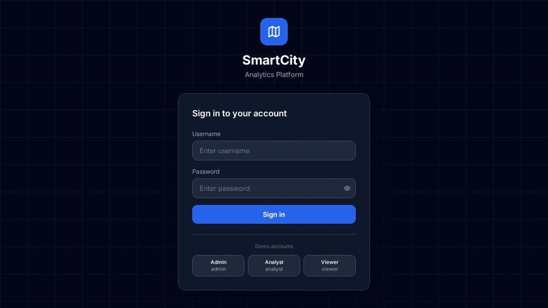

# 🏙️ SmartCity Analytics Platform

An AI-powered full-stack Smart City Analytics Platform that collects, analyzes, and visualizes urban data including traffic congestion, air pollution, public transportation, and energy consumption.

## 🚀 Live Demo

**[https://smart-city-analytics-platform.onrender.com](https://smart-city-analytics-platform.onrender.com)**

> Free tier — first load may take 30–60 seconds to wake up.



## ✨ Features

### Core Modules
- **Traffic Analytics** — Live zone monitoring, congestion heatmaps, peak-hour analysis, incident tracking
- **Pollution Monitoring** — AQI, PM2.5, CO₂, temperature tracking with city map overlays
- **Transport Analytics** — Route performance, delay tracking, passenger flow, on-time statistics
- **Energy Consumption** — Sector-wise usage, anomaly detection, cost analysis, saving recommendations
- **AI Prediction Engine** — ML forecasts for traffic, pollution & energy (95%+ accuracy on traffic/AQI)
- **Smart Alerts System** — Multi-category alerts with severity levels, read/resolve workflow
- **AI Chatbot** — Context-aware city assistant powered by live data
- **Admin Panel** — Zone management, user management, downloadable analytics reports
- **Dark / Light Mode** — Toggle in the header, preference saved across sessions

### Tech Stack

| Layer | Technology |
|-------|-----------|
| Frontend | React 18, Vite, Tailwind CSS, Recharts, Leaflet |
| Backend | Python FastAPI, SQLAlchemy, SQLite |
| ML | Scikit-learn (Random Forest, Gradient Boosting) |
| Auth | JWT tokens, bcrypt |
| Maps | React-Leaflet + OpenStreetMap |

## 🛠️ Local Setup

### Prerequisites
- Python 3.10+
- Node.js 18+

### Backend

```bash
cd backend
pip install -r requirements.txt
python3 run.py
# API running at http://localhost:8000
# Swagger docs at http://localhost:8000/docs
```

### Frontend

```bash
cd frontend
npm install
npm run dev
# App running at http://localhost:5173
```

### Demo Accounts

| Role | Username | Password |
|------|----------|----------|
| Admin | `admin` | `admin123` |
| Analyst | `analyst` | `analyst123` |
| Viewer | `viewer` | `viewer123` |

## 📊 ML Model Performance

| Model | Algorithm | R² Score | Confidence |
|-------|-----------|----------|------------|
| Traffic Congestion | Random Forest | 0.957 | 95.7% |
| AQI Pollution | Gradient Boosting | 0.952 | 95.2% |
| Energy Demand | Gradient Boosting | 0.306 | 30.6% |

> Models train on 30 days of historical city data (7,200+ records per module) at startup.

## 🗂️ Project Structure

```
smart-city-platform/
├── backend/
│   ├── app/
│   │   ├── main.py          # FastAPI app + lifespan
│   │   ├── database.py      # SQLAlchemy setup
│   │   ├── models/          # DB models
│   │   ├── schemas/         # Pydantic schemas
│   │   ├── routers/         # API routes (10 modules)
│   │   ├── ml/              # ML training + prediction
│   │   └── utils/           # Auth, data generator
│   └── requirements.txt
└── frontend/
    └── src/
        ├── pages/           # 8 full pages
        ├── components/      # Layout, KPICard, Chatbot
        ├── api/             # Axios service layer
        └── context/         # App state
```

## 📡 API Endpoints

| Module | Base Path |
|--------|-----------|
| Auth | `/api/auth/` |
| Dashboard | `/api/dashboard/` |
| Traffic | `/api/traffic/` |
| Pollution | `/api/pollution/` |
| Transport | `/api/transport/` |
| Energy | `/api/energy/` |
| Predictions | `/api/predictions/` |
| Alerts | `/api/alerts/` |
| Admin | `/api/admin/` |
| Chatbot | `/api/chatbot/` |

Full interactive docs: `http://localhost:8000/docs`

---

Built with ❤️ using FastAPI + React
